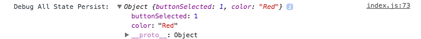
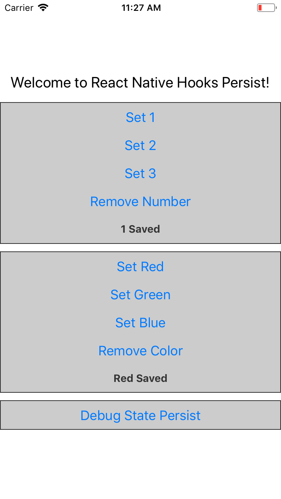

# React-Native Hooks Persist

<a href="url"></a>

React Native Hooks Persist with Async Storage


[](#contributors)


## Getting Started
### Install
`yarn add react-native-hooks-persist`

or

`npm install react-native-hooks-persist`

### Methods


| Name               | Description               |
| :----------------- | :------------------------ |
| useStatePersist    | Main hook persist method  |
| removeStatePersist | Remove an item from Store |
| debugStatePersist  | Debug all items on Store  |

## Basic usage

### imports
```
import {
  useStatePersist,
  removeStatePersist,
  debugStatePersist,
} from 'react-native-hooks-persist';

const DB_NAME = 'globalStorage';
const FIELD_KEY = 'selectedColor';
const INITIAL_VALUE = 'Red';
```

### Create
`const [color, setColor] = useStatePersist(DB_NAME, FIELD_KEY, INITIAL_VALUE);`
### Read
`<Text>{color.selectedColor} Selected</Text>`
### Update
`setColor(DB_NAME, FIELD_KEY, 'Blue');`
### Delete
`removeStatePersist(DB_NAME, FIELD_KEY);`
### Debug all Items
`debugStatePersist(DB_NAME);`

<a href="url"></a>


## Example in `/demo`

### Run in demo folder:
- `yarn` or `npm install`

- `react-native start`

- `react-native run-ios` or `react-native run-android`

<a href="url"></a>

## Contributing

- Clone this Repo
- Install dependencies
- Checkout develop branch
- Add your feature or fix
- Make sure your improvement works
- Open a pull request

---
Baked with Love ♥ from Cologne & Huelva

## Contributors ✨

Thanks goes to these wonderful people ([emoji key](https://allcontributors.org/docs/en/emoji-key)):

<!-- ALL-CONTRIBUTORS-LIST:START - Do not remove or modify this section -->
<!-- prettier-ignore -->
<table>
  <tr>
    <td align="center"><a href="https://github.com/Yaxian"><br /><sub><b>Yaxian</b></sub></a><br /><a href="https://github.com/rcerrejon/react-native-hooks-persist/commits?author=Yaxian" title="Code">💻</a></td>
  </tr>
</table>

<!-- ALL-CONTRIBUTORS-LIST:END -->

This project follows the [all-contributors](https://github.com/all-contributors/all-contributors) specification. Contributions of any kind welcome!
